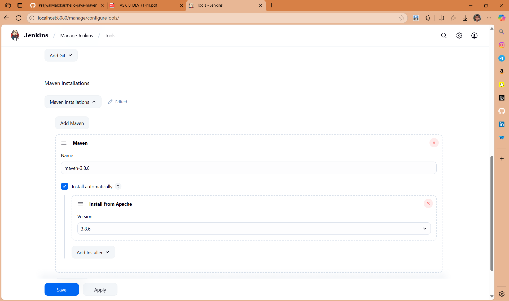
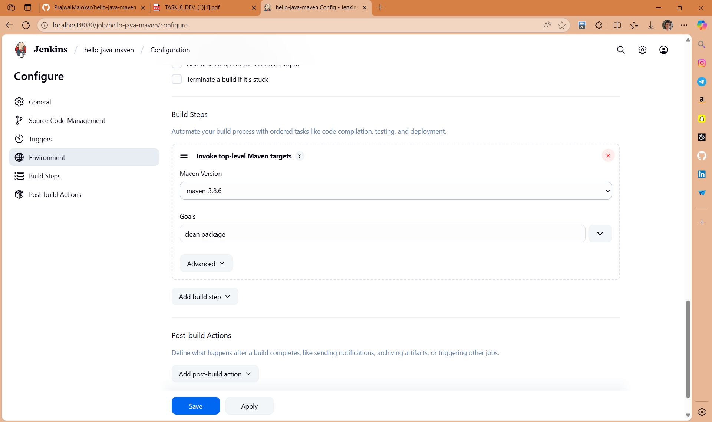
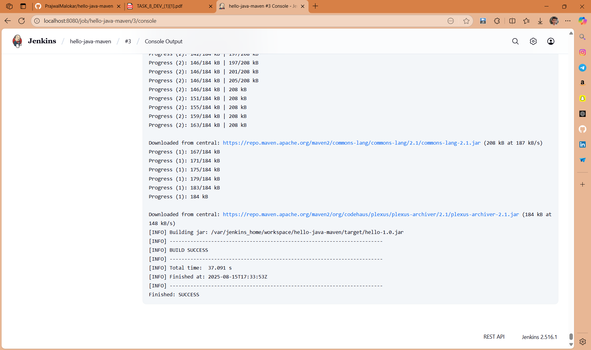

# Hello Java Maven - Jenkins Build

## 📌 Project Overview
This project demonstrates how to set up a **Jenkins Freestyle job** to build a simple Java application using **Maven**.  
The goal is to get familiar with Continuous Integration (CI) basics.

---

## 🛠 Tools Used
- **Java JDK** (8 or 11)
- **Maven** (3.8.x)
- **Jenkins** (LTS)
- **Git** (for version control)

---

## 📂 Project Structure
```
hello-java-maven/
├── pom.xml
└── src/
	└── main/
		└── java/
			└── HelloWorld.java
```

**HelloWorld.java**
```java
public class HelloWorld {
	public static void main(String[] args) {
		System.out.println("Hello, Jenkins + Maven!");
	}
}
```

**pom.xml**

```xml
<project>
	<modelVersion>4.0.0</modelVersion>
	<groupId>com.example</groupId>
	<artifactId>hello</artifactId>
	<version>1.0</version>

	<build>
		<plugins>
			<plugin>
				<groupId>org.apache.maven.plugins</groupId>
				<artifactId>maven-compiler-plugin</artifactId>
				<version>3.8.1</version>
				<configuration>
					<source>1.8</source>
					<target>1.8</target>
				</configuration>
			</plugin>
		</plugins>
	</build>
    
</project>
```

---

## 🚀 Steps to Run in Jenkins

### 1. Start Jenkins

If using Docker:

```bash
docker run -p 8080:8080 jenkins/jenkins:lts
```

### 2. Configure Maven in Jenkins

1. Go to **Manage Jenkins → Global Tool Configuration**.
2. Under **Maven**, click **Add Maven**.
3. Name: `maven-3.8.6`.
4. Tick **Install automatically**.
5. Save.

**Screenshot – Maven Configuration in Jenkins:**


---

### 3. Create a Jenkins Freestyle Job

1. Go to **New Item → Freestyle project**.
2. Set project name: `hello-java-maven`.
3. In **Source Code Management**, select **Git** and enter your repository URL.
4. In **Build**:

   - Add build step → **Invoke top-level Maven targets**.
   - Goals:

	 ```
	 clean package
	 ```
   - Select Maven installation (`maven-3.8.6`).

**Screenshot – Job Configuration:**


---

### 4. Build the Job

- Click **Build Now**.
- Check **Console Output** → You should see:

```
[INFO] BUILD SUCCESS
```

**Screenshot – Build Success Output:**


---

## ✅ Expected Output

When running the job successfully, Maven will compile and package the Java application.
You should see:

```
Hello, Jenkins + Maven!
[INFO] BUILD SUCCESS
```

---

## 📜 License

This project is licensed under the MIT License.

---

